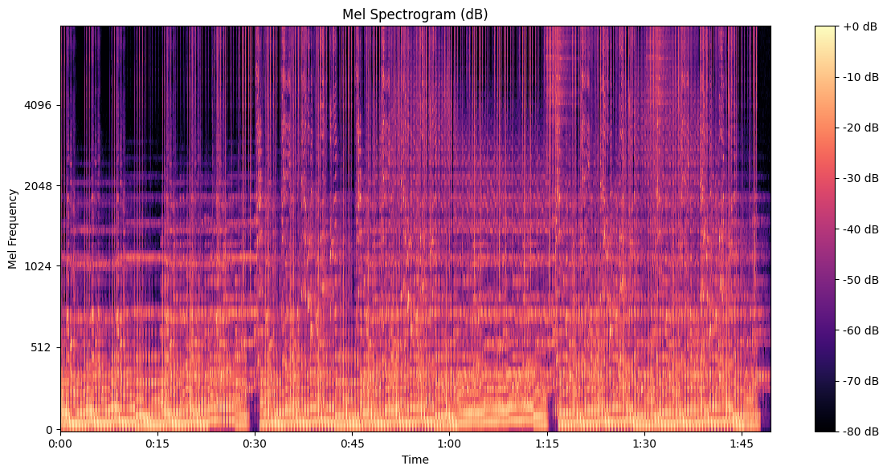

# Music Classifier

**Exploring music discovery through audio features, learned embeddings, and clustering.**

An honors project investigating how the sound of a track can help organize a music collection. The workflow combines audio descriptors and visual representations with a learned embedding model, then groups tracks using a saved clustering model.

## Technical focus

- Audio features including MFCCs, chroma, spectral contrast, tonnetz, onset strength, and tempo.
- Spectrogram and feature visualizations for inspecting a track's structure.
- TensorFlow / Keras experiments for embedding generation.
- Cluster assignment and playlist-style organization of new songs.

## Repository guide

| File | Responsibility |
| --- | --- |
| `MODEL.ipynb` | Model experimentation and training |
| `Features.py` | Feature extraction and visualization |
| `USING_THE_MODEL.py` | Embedding inference, clustering, and file organization |
| `kmeans_song_cluster.joblib` | Saved clustering model |
| `song_embeddings.npy` and `song_files.npy` | Stored embeddings and file references |
| `IMAGES/` | Example audio visualizations |

**Stack:** Python, librosa, TensorFlow / Keras, NumPy, scikit-learn, Matplotlib, and Plotly.

## Reproducing the workflow

Start with `MODEL.ipynb` and `Features.py` to inspect the experiments and feature pipeline. The repository includes the original dependency snapshot in `requirements.txt`.

The inference script expects a `song_embedding_model.keras` file, which is not included in the current repository. Supply or train a compatible model before running inference, and configure the input and output directories in `USING_THE_MODEL.py`.

The script moves processed audio into cluster folders. Use a copy of your audio collection when experimenting.

This is an experimental music-organization workflow; no benchmark accuracy is claimed.

Built by [Arya Prabhu](https://github.com/WILDROP321).
